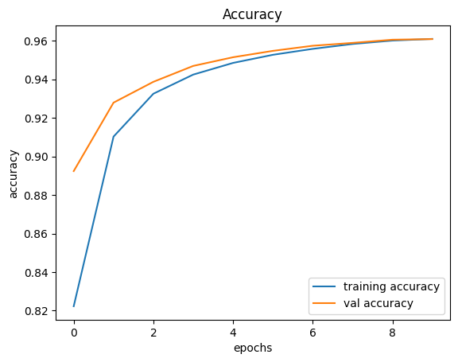
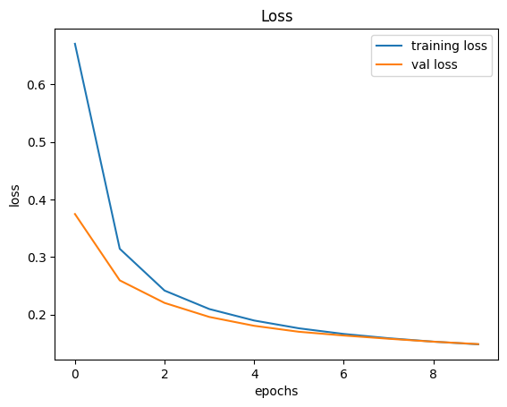
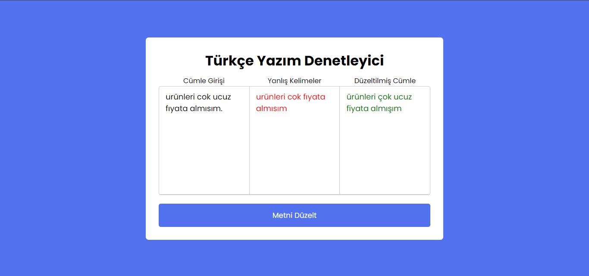

# Deep Learning Based Spell Checker Tool for Turkish

## Description
This project aims to develop a deep learning model that corrects misspellings in Turkish text written online. The model utilizes a dataset consisting of incorrectly spelled words from user comments and tweets, paired with their correct forms. By leveraging the Zemberek library for tokenization and morphological analysis, the model identifies and corrects misspelled words in real-time. The model implemented on a web application using flask.

## Dataset
The dataset used for training the deep learning model is a combination of Turkish product reviews and tweets. This diverse dataset enables the model to learn a wide range of misspellings commonly found in online text. The sentences in the dataset are transformed into pairs of incorrect words and their corresponding correct forms using the Zemberek library.

## The Model
The model is a "sequence to sequence" model as we translate one sequence of numbers into another sequence of numbers. This is done using the "Encoder Decoder" architecture. LSTM recurrent neural network (RNN) was used to implement this architecture.

|Layer (type)   | Output Shape   | Param # 
| ----------- | ----------- | ----------
| encode_1 (Input Layer)| (None, 22, 36)| 0
| masking (Masking)| (None, 22, 36)| 0|
| decoder_inputs (Input Layer)| (None, None, 36)| 0
| encode_lstm2 (LSTM)| [(None, 22, 36),(None, 36),(None, 36)]| 10,512
| decoder_lstm (LSTM)| [(None, None,36), (None, 36),(None, 36)]| 10,512
| decoder_dense (Dense)| (None, None, 36)| 1,332

- Total params: 22,356 
- Trainable params: 22,356 
- Non-trainable params: 0 

### Trainig of the model

## Methodology
1. Input Processing: Text entered by the user through the interface is tokenized using the Zemberek library, dividing the sentences into individual words.
2. Morphological Analysis: Each word undergoes morphological analysis using the Zemberek library to determine its correctness. Incorrectly identified words are flagged for correction.
3. Deep Learning Model: The flagged incorrect words are fed into a deep learning model based on LSTM architecture for spelling correction. The model learns from the dataset to predict the correct forms of misspelled words.
4. Normalization: The corrected versions of the words are obtained through the deep learning model.
5. Output: The corrected words are returned to the interface for display to the user, providing real-time spelling correction

## Web Application Examples

## The tecnologies
- Zemberek: preparing the dataset, detection of misspelled words
- Numpy, pandas: preparing the dataset for model (one-hot encoding etc.)
- Tensorflow, keras : Training the deep learning model (LSTM, encoder-decoder) 
- Flask : Implementing the website

